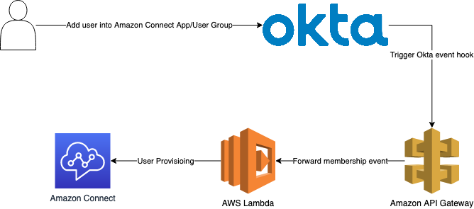

## Automatic User Provisioning from Okta to Amazon Connect

Amazon Connect is a cloud-based contact center solution that provides businesses with a set of tools to interact with your customers. Amazon Connect supports SAML 2.0-based authentication to  simplify the process of managing user access to applications and resources, and the employees don't need to remember multiple usernames and passwords, making it easier for them to access the resources they need. Okta is a popular identity and access management solution that many customers may choose inside their organizations and use it to integrate with Amazon Connect. AWS has blog and workshop to guide you how to setup your Amazon Connect instance with OKTA step by step.

However, currently it doesn't support automatic user provisioning from Okta to Amazon Connect. That means even when you add users into your applications on Okta, and you still needs to manually create those users on Amazon Connect or upload the user list through a Amazon Connect [csv template](https://docs.aws.amazon.com/connect/latest/adminguide/user-management.html#add-users-in-bulk).

With this sample, customers who use Okta can easier refer this sample to implement the automatic user provisioning from Okta to Amazon Connect.


## Implementation

To sync the users created in Okta to Amazon Connect, we need to leverage [Okta event hooks](https://help.okta.com/en-us/Content/Topics/automation-hooks/event-hooks-main.htm) to automatically provision users to Amazon Connect with mapping routing profile and security profiles to give the proper permissions to your agents.

This sample provides an AWS Lambda code which can be used to retrieve the event hooks from Okta and implements the [initial event hook verification](initial event hook verification) when the first time you setup event hook on your Okta org and the logic to create the users on Amazon Connect.

## Setup

* [Configure Single Sign-On for Amazon Connect Using Okta](https://aws.amazon.com/blogs/contact-center/configure-single-sign-on-for-amazon-connect-using-okta/)
* Clone this code and change the **config.ini**
* Setup [Okta event hooks](https://help.okta.com/en-us/Content/Topics/automation-hooks/event-hooks-main.htm)
* Subscribe specific [Okta events](https://developer.okta.com/docs/reference/api/event-types/)
  * `application.user_membership.add`
  * `group.user_membership.add`
* Deploy this Lambda and create your own Amazon API Gateway endpoint to integrate with this Lambda function
  * The execution role of this Lambda must have the permissions (such as `AmazonConnect_FullAccess`) to call Amazon Connect `Create User` API
    * You can refer [Required permissions for custom IAM policies on Amazon Connect](https://docs.aws.amazon.com/connect/latest/adminguide/security-iam-amazon-connect-permissions.html) to narrow down the permissions for creating users on Amazon Connect
  * Create API Gateway resource with GET/POST method for your endpoint
    * `GET` method - for One-Time Okta Verification Request
    * `POST` method - for handling Okta membership event hook
* Use the API Gateway endpoint to pass [One-Time Okta Verification Request](https://developer.okta.com/docs/concepts/event-hooks/#one-time-verification-request)
* You can start to add agents into your Okta Amazon Connect App and sync the user to Amazon Connect

## Configurations

Change configs in the **config.ini** to fit your Amazon Connect and Okta settings

```[OKTA]
APP_NAME = AWS Account Federation  # Your Amazon Connect application name in Okta
GROUP_NAME = amazon_connect # The user group ties to your Amazon Connect Application
APP_MEMBERSHIP_ADD_EVENT = application.user_membership.add # Membership evet of User provisioning to app
GROUP_MEMBERSHIP_ADD_EVENT = group.user_membership.add # Membership event of adding user to user group

[Connect]
SECURITY_PROFILE_IDS = 12345678-1234-2345-abd8-0aa7f5b46852, 65345678-1234-2345-abd8-0aa7f5b46852, 98345678-1234-2345-abd8-0aa7f5b46852 # Bind security profile to the provisioning agents
ROUTING_PROFILE_ID = 87654321-69fb-43b6-a5e6-f8666ac189cb # Bind routing profile to provisioning agents
INSTANCE_ID = abcdefgh-0122-4131-adc2-a0ebe5a2b2a7 # Your Amazon Connect Instance ID
```

## Okta Event Hooks Sample
### User assigned to app (application.user_membership.add)
```
{
    "eventType": "com.okta.event_hook",
    "eventTypeVersion": "1.0",
    "cloudEventsVersion": "0.1",
    "source": "https://dev-51269148.okta.com/api/v1/eventHooks/who76u07z3iS7dl2P5d7",
    "eventId": "ffe9af67-e56c-4229-b6c9-96f66ed382f1",
    "data": {
        "events": [
            {
                "uuid": "4a19d863-4e0e-4645-bce4-2850f783a55f",
                "published": "2022-12-21T13:47:07.306Z",
                "eventType": "application.user_membership.add",
                "version": "0",
                "displayMessage": "Add user to application membership.",
                "severity": "INFO",
                "client": {
                    "userAgent": {
                        "rawUserAgent": "Mozilla/5.0 (Macintosh; Intel Mac OS X 10.15; rv:107.0) Gecko/20100101 Firefox/107.0",
                        "os": "Mac OS X",
                        "browser": "FIREFOX"
                    },
                    "zone": null,
                    "device": "Computer",
                    "id": null,
                    "ipAddress": "27.0.3.153",
                    "geographicalContext": {
                        "city": "Tokyo",
                        "state": "Tokyo",
                        "country": "Japan",
                        "postalCode": "151-0053",
                        "geolocation": {
                            "lat": 35.6893,
                            "lon": 139.6899
                        }
                    },
                    "ipChain": null
                },
                "device": null,
                "actor": null,
                "outcome": {
                    "result": "Success",
                    "reason": null
                },
                "target": null,
                "transaction": {
                    "type": null,
                    "id": "Y6MOW1BKZOMCPY-0KuwaPAAADLo",
                    "detail": null
                },
                "debugContext": null,
                "legacyEventType": "app.generic.provision.assign_user_to_app",
                "authenticationContext": {
                    "authenticationProvider": null,
                    "credentialProvider": null,
                    "credentialType": null,
                    "issuer": null,
                    "authenticationStep": 0,
                    "externalSessionId": null,
                    "interface": null
                },
                "securityContext": null,
                "insertionTimestamp": null
            }
        ]
    },
    "eventTime": "2022-12-21T13:47:07.354Z",
    "contentType": "application/json"
}
```

### User added to group (group.user_membership.add)

```
{
    "eventType": "com.okta.event_hook",
    "eventTypeVersion": "1.0",
    "cloudEventsVersion": "0.1",
    "source": "https://dev-51269148.okta.com/api/v1/eventHooks/who76u07z3iS7dl2P5d7",
    "eventId": "0d6c348d-a771-49dd-9eb7-655167f26501",
    "data": {
        "events": [
            {
                "uuid": "def83a9d-9487-42bf-b6ae-de748ebdb19c",
                "published": "2022-12-21T13:48:32.767Z",
                "eventType": "group.user_membership.add",
                "version": "0",
                "displayMessage": "Add user to group membership.",
                "severity": "INFO",
                "client": {
                    "userAgent": {
                        "rawUserAgent": "Mozilla/5.0 (Macintosh; Intel Mac OS X 10.15; rv:107.0) Gecko/20100101 Firefox/107.0",
                        "os": "Mac OS X",
                        "browser": "FIREFOX"
                    },
                    "zone": null,
                    "device": "Computer",
                    "id": null,
                    "ipAddress": "27.0.3.153",
                    "geographicalContext": {
                        "city": "Tokyo",
                        "state": "Tokyo",
                        "country": "Japan",
                        "postalCode": "151-0053",
                        "geolocation": {
                            "lat": 35.6893,
                            "lon": 139.6899
                        }
                    },
                    "ipChain": null
                },
                "device": null,
                "actor": null,
                "outcome": {
                    "result": "Success",
                    "reason": null
                },
                "target": null,
                "transaction": {
                    "type": null,
                    "id": "Y6MOsB1cPd-I1i0pJYAp3QAADyM",
                    "detail": null
                },
                "debugContext": null,
                "legacyEventType": "core.user_group_member.user_add",
                "authenticationContext": {
                    "authenticationProvider": null,
                    "credentialProvider": null,
                    "credentialType": null,
                    "issuer": null,
                    "authenticationStep": 0,
                    "externalSessionId": null,
                    "interface": null
                },
                "securityContext": null,
                "insertionTimestamp": null
            }
        ]
    },
    "eventTime": "2022-12-21T13:48:32.813Z",
    "contentType": "application/json"
}
```

## Reference

* [Amazon Connect Boto3 document(Python)](https://boto3.amazonaws.com/v1/documentation/api/latest/reference/services/connect.html#Connect.Client.create_user)
* [Amazon Connect API reference](https://docs.aws.amazon.com/connect/latest/APIReference/Welcome.html)
* [Configure Single Sign-On for Amazon Connect Using Okta](https://aws.amazon.com/blogs/contact-center/configure-single-sign-on-for-amazon-connect-using-okta/)
* [Okta Automations and hooks - Event hooks](https://help.okta.com/en-us/Content/Topics/automation-hooks/event-hooks-main.htm)

## Security

See [CONTRIBUTING](CONTRIBUTING.md#security-issue-notifications) for more information.

## Reporting Bugs
If you encounter a bug, please create a new issue with as much detail as possible and steps for reproducing the bug. See the [Contributing Guidelines](./CONTRIBUTING.md) for more details.

## License

This library is licensed under the MIT-0 License. See the LICENSE file.
