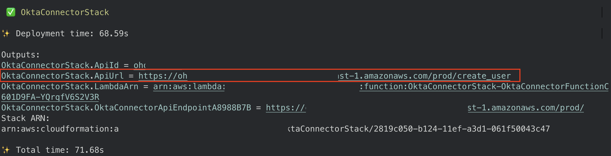

## Automate agent onboarding with Amazon Connect using Okta

Efficient agent onboarding is critical for the success of modern contact centers, where staffing changes are frequent due to business needs, seasonal demands, and specialized skills. Automating agent provisioning can reduce errors, enhance security, and speed up the onboarding process. This integration enables automatic agent provisioning, ensuring accuracy, compliance, and streamlined onboarding through an architecture that leverages Okta Web Hooks, AWS Lambda, Amazon API Gateway and Amazon Connect.


## How it works
1.	An agent is added to the Amazon Connect group in Okta.
2.	Adding the agent to the Amazon Connect Agents group triggers an [Event Hook in Okta](https://help.okta.com/en-us/Content/Topics/automation-hooks/event-hooks-main.htm), sending the agent details to the Amazon API Gateway.
3.	Amazon API Gateway calls the AWS Lambda function to process the request.
4.	The Lambda function uses the agent details to create the agent in Amazon Connect using [CreateUser API](https://docs.aws.amazon.com/connect/latest/APIReference/API_CreateUser.html).
## Deployment
### Deploy Web Hook API
* [Configure Single Sign-On for Amazon Connect Using Okta](https://aws.amazon.com/blogs/contact-center/configure-single-sign-on-for-amazon-connect-using-okta/)
* Before you begin CDK deployment, ensure you have the following IDs ready: [Amazon Connect Instance ID](https://docs.aws.amazon.com/connect/latest/adminguide/find-instance-arn.html), [Security Profile ID](https://docs.aws.amazon.com/cli/latest/reference/connect/list-security-profiles.html), and [Routing Profile ID](https://docs.aws.amazon.com/cli/latest/reference/connect/list-routing-profiles.html). 
* Run the following commands to start CDK deployment 
```
git clone https://github.com/aws-samples/amazon-connect-user-provision-with-okta.git
cd amazon-connect-user-provision-with-okta
chmod a+x bootstrap.sh start.sh cleanup.sh
./bootstrap.sh
./start.sh
```


Copy the `OktaConnectorStack.ApiUrl` value from the final output after the execution completes. This URL will act as the endpoint for your Okta Event Hook.

### Configure Okta Group and Application Assignment 
* **Log in to the Okta Admin Console.** - Access your [Okta Admin Console dashboard](https://login.okta.com/) using your admin credentials.
* **Navigate to the Groups Menu.** Go to the **Directory** section and Click on the **Groups** menu.
* **Create a New Group.** Click the **Add Group** button, in the form that appears: Enter a Name: Amazon Connect Agents. Optionally, add a Description. Click **Save** to create the group.
* **Navigate to Groups** and click on the newly created **Amazon Connect Agents** group.
* **Assign the Amazon Connect Application.** Click the **Assign Applications button**, from the list of available applications, select **Amazon Connect**. 
* During assignment, select the **Okta_Role** option. Click **Save and Go Back** to complete the process. 

### Configure Okta Web Hook 

* **Navigate to the Setting Menu**. Go to the **Features Menu** and enable **Event Hook Filtering**.
* **Navigate to the Workflow Menu**. Go to the **Even Hooks** section and Click **Create Event Hook**.

* Complete these fields:
```
Endpoint URL: Enter the endpoint URL (OktaConnectorStack.ApiUrl output that was provided during CDK deployment)
Event Hook name: Enter a unique name for the event hook.
Description: Enter the purpose and a description of the event hook.
Select Events: Select User added to group option form dropdown menu.
```
* Click **Save & Continue**.
* Select the **Apply Filter option**, then click on the **Use Okta Expression Language (Advanced) link**. 
* Next, paste the following expression language into the provided field: `event.target.?[type eq 'UserGroup' && displayName eq 'Amazon Connect Agents'].size()> 0` and click **Save**.

* To activate the hook, verify endpoint ownership by clicking the **Verify button**. You should receive successful verification message. 


 ### Testing
*  **Log in to the Okta Admin Console.** - Access your [Okta Admin Console dashboard](https://login.okta.com/) using your admin credentials.
*  **Navigate to the People Menu**. Go to the **Directory** section and Click on the **People** menu.
* Click the **Add Person button**, complete the **Add Person form**, and then click **Save**.
* **Navigate to the Groups Menu**. Go to the **Directory** section and Click on the **Groups** menu.
* Select **Amazon Connect Agents group** and click on **Assign people** button. Select user you just created by clicking on the **+** sign. 
* Login to your Amazon Connect instance. 
* In the left-hand navigation pane, go to **Users** and select **User Management**. You should now see that the agent created in Okta has been automatically provisioned in Amazon Connect. 


## Clean up
```
In your terminal, move into the root directory cd amazon-connect-user-provision-with-okta
Run ./cleanup.sh command 
Optionally, remove Web Hook from Okta
```

## Reference
* [Amazon Connect Boto3 document(Python)](https://boto3.amazonaws.com/v1/documentation/api/latest/reference/services/connect.html)
* [Amazon Connect API reference](https://docs.aws.amazon.com/connect/latest/APIReference/Welcome.html)
* [Configure Single Sign-On for Amazon Connect Using Okta](https://aws.amazon.com/blogs/contact-center/configure-single-sign-on-for-amazon-connect-using-okta/)
* [Okta Automations and hooks - Event hooks](https://help.okta.com/en-us/Content/Topics/automation-hooks/event-hooks-main.htm)

## Reporting Bugs
If you encounter a bug, please create a new issue with as much detail as possible and steps for reproducing the bug. See the [Contributing Guidelines](./CONTRIBUTING.md) for more details.

## Security

See [CONTRIBUTING](CONTRIBUTING.md#security-issue-notifications) for more information.

## License

This library is licensed under the MIT-0 License. See the LICENSE file.
